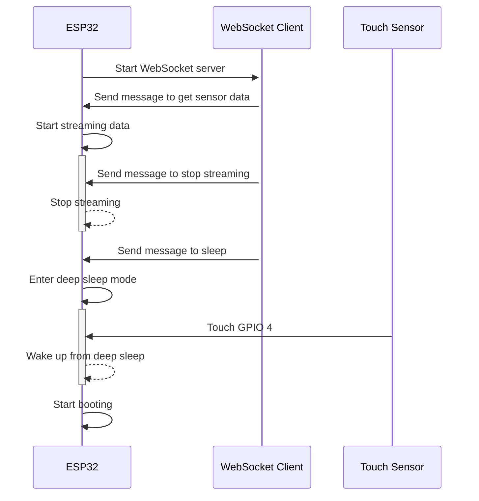

# hakaru
Stream the sensor data

```mermaid
sequenceDiagram
    participant ESP32 as ESP32
    participant Client as WebSocket Client
    participant TouchSensor as Touch Sensor

    ESP32->>+Client: Start WebSocket server
    Client->>ESP32: Send message to get sensor data
    ESP32->>+ESP32: Start streaming data
    Client->>ESP32: Send message to stop streaming
    ESP32-->>-ESP32: Stop streaming
    Client->>ESP32: Send message to sleep
    ESP32->>+ESP32: Enter deep sleep mode
    TouchSensor->>ESP32: Touch GPIO 4
    ESP32-->>-ESP32: Wake up from deep sleep
    ESP32->>+ESP32: Start booting
```
