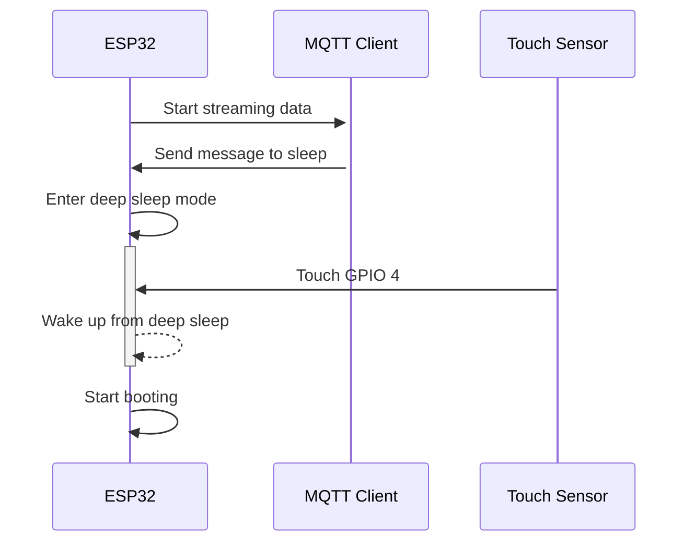

# hakaru
Stream the sensor data



## Set up WiFi
1. Connect to the ESP32's WiFi AP
2. Open http://192.168.1.1
3. Select the SSID and enter the password of the WiFi network

Then the ESP32 will connect to the WiFi network and start streaming data.  
The WiFi configuration will be saved in the flash memory.

Check if the ESP32 is connected to the WiFi network
```bash
ping opencmm.local
```

## Install Mosquitto MQTT Broker

ref. https://www.vultr.com/docs/install-mosquitto-mqtt-broker-on-ubuntu-20-04-server/

/etc/mosquitto/conf.d/default.conf
```
listener 1883 0.0.0.0
allow_anonymous false
password_file /etc/mosquitto/passwd
```

### Receive data

```bash
mosquitto_sub -t 'sensor/data' -v -h 192.168.10.104 -u opencmm -P opencmm
```

### Send command to ESP32

Update configuration
```bash
mosquitto_pub -t 'sensor/control' -h 192.168.10.104 -u opencmm -P opencmm -m '{"command": "config", "interval": 1000, "threshold": 100 }'
```

Go to sleep
```bash
mosquitto_pub -t 'sensor/control' -h 192.168.10.104 -u opencmm -P opencmm -m '{"command": "deepSleep" }'
```

Reset WiFi
```bash
mosquitto_pub -t 'sensor/control' -h 192.168.10.104 -u opencmm -P opencmm -m '{"command": "resetWifi" }'
```